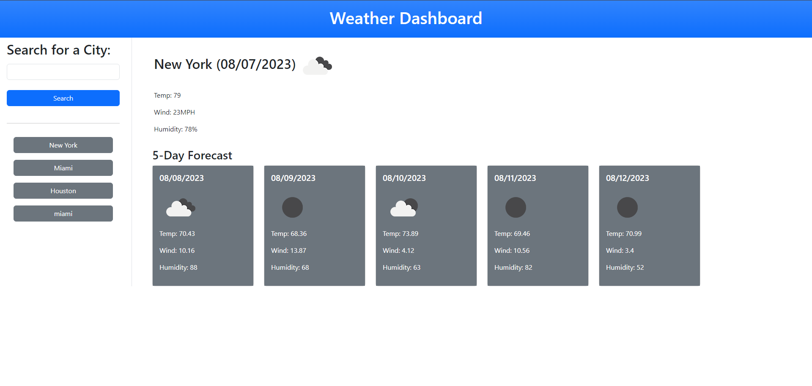

# WeatherDashboard

## Description
A weather dashboard that uses third party API, Open Weather, to display the 5 day forecast for any given city.

## Table of Contents 

- [Installation](#installation)
- [Usage](#usage)
- [Credits](#credits)
- [License](#license)

## Installation

You can access this project by clicking the following link: https://therealmi.github.io/WeatherDashboard/

## Usage
Use search bar to look up a 5 day weather forecast for different cities.

## Credits

[Coding Bootcamp](https://courses.bootcampspot.com)

[Professor Phil Loy](https://github.com/philliploy)

[w3 Schools](https://www.w3schools.com/)

[Bootstrap Documentation](https://getbootstrap.com/docs/5.3/getting-started/introduction/)

## License

[Please refer to the license on the repo](LICENSE)